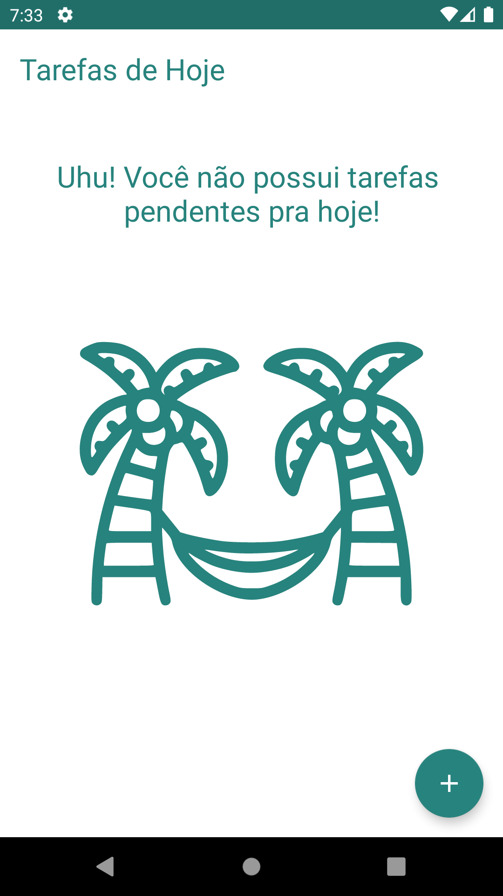
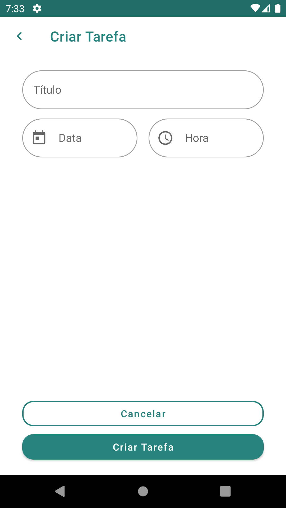
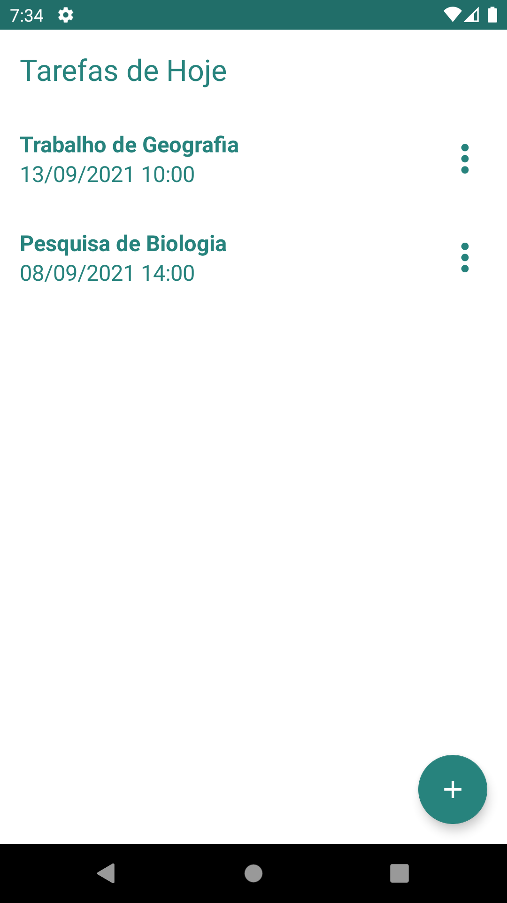
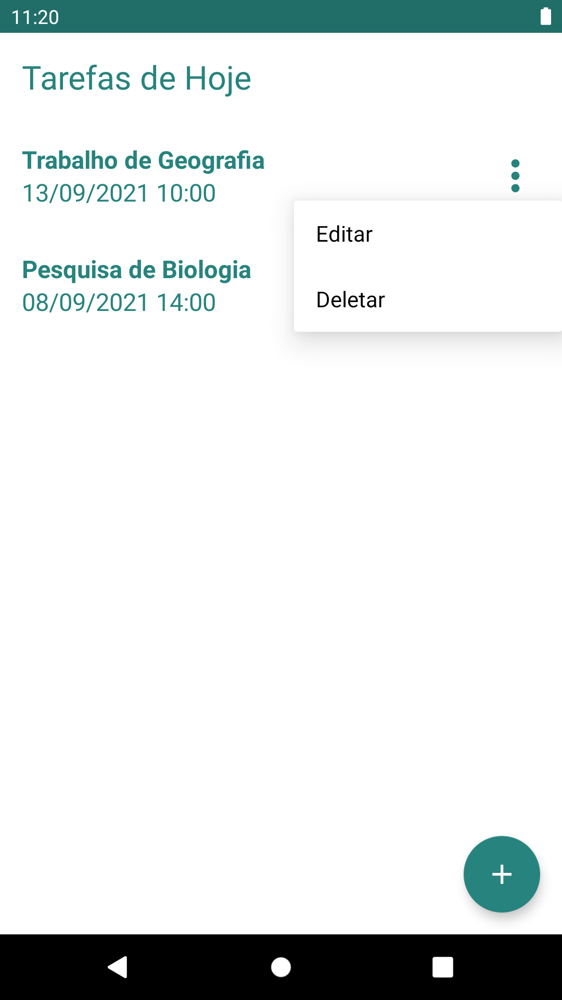

# **ToDoApp**

### Projeto Final do Bootcamp Santander Mobile do Digital Innovation One
Um App básico de lista de tarefas que possui a opção de adicionar, editar e excluir tarefas. Utilizando o banco de dados local por meio do Room para guardar os dados inseridos pelo usuário.

### Tecnologias

- [x] [Kotlin](https://kotlinlang.org/)
- [x] [CRUD SQLite](https://developer.android.com/training/data-storage/sqlite)
- [x] [ROOM](https://developer.android.com/training/data-storage/room)

### Telas
  
  
  
  
